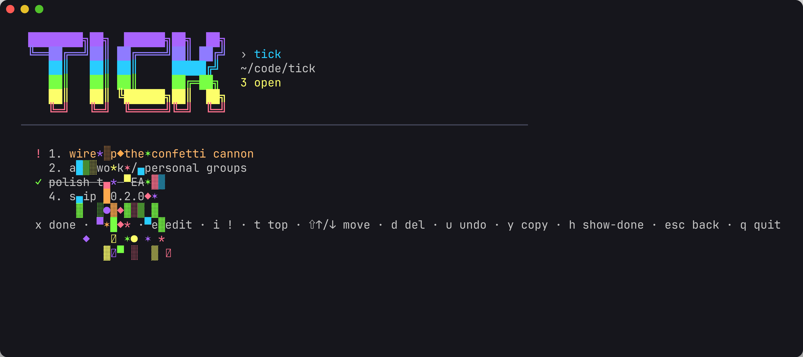

# tick

Jot down the next open steps in your projects and cross them off — with a
satisfying confetti pop. On your Mac as a CLI/TUI, on your iPhone as a native
app, kept in sync through a tiny server you host yourself.



The idea: when you sit down on a project — or think about it on the couch —
you see **that project's** next steps and nothing else. No cross-project task
soup, no context switch.

- **Per-project** — run `tick` inside a repo to manage that project's steps.
- **Globally** — `tick ui` lists every tracked project; pick one.
- **On the phone** — projects → one project's steps; a home-screen widget
  shows the next steps of whatever you touched last.
- **Offline-first** — edit anywhere, any time; devices converge when they're
  back online (deletions included — nothing resurrects).

Steps live in a single global store (`~/.config/tick/store.json`, honoring
`XDG_CONFIG_HOME`). Nothing is written into your repos.

## Install

```sh
go install github.com/simontheguitarist/tick/cmd/tick@latest
# or from a checkout:
go install ./cmd/tick
```

Requires Go 1.26+. The first run after upgrading from a pre-sync version
migrates your store in place (a one-time `store.v1.json` backup is kept).

## Interactive (TUI)

```sh
tick        # tracked dir -> that project's steps; untracked -> global overview
tick ui     # always open the global overview
```

Steps are a **priority list, not a checklist**: open steps are numbered
`1. 2. 3.` top-to-bottom, and you order them yourself.

**Steps screen** — `x`/`enter` cross off (confetti!) or reopen a done step ·
`a` add · `e` edit · `i` mark important (adds a `!`, keeps its position) ·
`t` bump to the top · `⇧↑`/`⇧↓` reorder · `d` delete · `u` undo a delete ·
`y` copy the project's path · `h` show/hide done · `esc`/`g` overview ·
`q` quit.

**Overview** — `↑`/`↓` or `j`/`k` move · `enter` open (or **+ Track current
dir**) · `g` assign the project to a group (type a name, blank clears) ·
`y` copy its path · `d` untrack a project (with confirm) · `q` quit.
Projects are shown in sections by group, with ungrouped ones last. Projects
created on the phone show as *(not linked)* until you run `tick` (or
`tick link`) in their directory.

**Editing prompts** (add / edit / group) support a real cursor: `←`/`→`,
`⌥←`/`⌥→` by word, `Home`/`End` (or `Ctrl-A`/`Ctrl-E`), `Delete`, `⌘V`.

## Scriptable

```sh
tick add "wire up confetti"     # append a step (creates the project on first add)
tick ls [--all] [--json]        # list open steps (--all includes done)
tick done 1 3                   # cross off step(s) by number
tick undone 2                   # reopen
tick rm 4                       # delete a step
tick edit 2 "new text"          # change a step's text
tick clear [--all-projects]     # drop done steps
tick projects [--json]          # all tracked projects + open counts
tick untrack [-y]               # stop tracking the current project
tick link [name]                # attach a phone-created project to this dir
```

Most commands accept `-p <path>` to target another project. Step numbers are
the ones shown by `tick ls`.

## Sync

Three steps, once:

```sh
# 1. run the server (see "Self-hosting" or use your existing one)
# 2. connect this Mac — prompts for the server's token
tick sync setup https://tick.example.com
# 3. pair the iPhone app: scan this with the app (or your camera)
tick sync qr
```

From then on every `tick` command syncs automatically — pull with a 1 s
budget before reads, push after writes, silently queued when offline; the
TUI syncs in the background and flushes on quit. `tick sync` forces a round
(`--full` re-syncs everything), `tick sync status` shows the connection and
what's queued, `tick sync off` disconnects and keeps your data.
`TICK_NO_SYNC=1` skips sync for one command.

How conflicts resolve, what's on the wire, and why it's built this way:
[docs/protocol.md](docs/protocol.md), [docs/decisions/](docs/decisions/).

## iPhone app

`ios/` — SwiftUI, iOS 26, built with [XcodeGen](https://github.com/yonaskolb/XcodeGen):

```sh
cd ios && xcodegen generate
open Tick.xcodeproj        # run on your iPhone from Xcode, or:
make ios                   # build for the simulator
```

Pair by scanning `tick sync qr` (or paste the `tick://pair…` link). Add the
**Next steps** widget to your home screen; long-press it to pin a project.
The app works fully offline and syncs on launch, foreground, and after
every edit.

## Self-hosting the server

`tickd` is one static binary with one JSON file on one volume and one
shared token — no database, no accounts.

```sh
cp deploy/.env.example deploy/.env      # set TICK_TOKEN (openssl rand -hex 32)
docker compose -f deploy/docker-compose.yml up -d --build
curl http://localhost:8080/healthz
```

Put TLS in front of it (any reverse proxy / PaaS) before leaving your LAN.
Env: `TICK_TOKEN` (required), `TICK_DATA_DIR` (`/data`), `TICK_ADDR`
(`:8080`), `TICK_LANDING_URL` (where a browser opening `/` is sent).

## How it works

- **Store** (`internal/store`) — one JSON file; every mutation is a locked
  read-modify-write (`flock`) with an atomic temp-file rename. Each step has
  an id, a fractional-index `rank` (order = priority, moving a step re-keys
  only that step), an `updated` stamp and a `dirty` flag; deletions leave
  tombstones. That's the whole outbox.
- **Sync** (`internal/sync`, `internal/protocol`) — one request: push dirty
  entities + cursor, receive everything newer. Per-entity last-writer-wins;
  the same merge rule is implemented in Go and Swift and tested against one
  case table; the rank algorithm is pinned by shared golden vectors.
- **Server** (`internal/server`, `cmd/tickd`) — stdlib `net/http`, bearer
  token, JSON document + mutex + atomic rename.
- **TUI** (`internal/tui`) — Bubble Tea v2 + Lip Gloss. Cross-off is
  *animate-then-remove*: persisted immediately, struck while the confetti
  (a `harmonica` particle simulation) plays, then dropped.
- **App** (`ios/`) — one JSON document in the App Group (shared with the
  widget), `@Observable` store, a sync engine that debounces edits and backs
  off when offline. See [docs/design.md](docs/design.md).

## Develop

```sh
make test              # go test ./...
make race              # with the race detector
make ios-test          # Swift tests in the simulator
make docker-build      # server image
```

Docs: [product](docs/product.md) · [design](docs/design.md) ·
[protocol](docs/protocol.md) · [decisions](docs/decisions/) ·
[review checklist](docs/review-checklist.md). Repo conventions and the
pre-merge gate live in [CLAUDE.md](CLAUDE.md).
